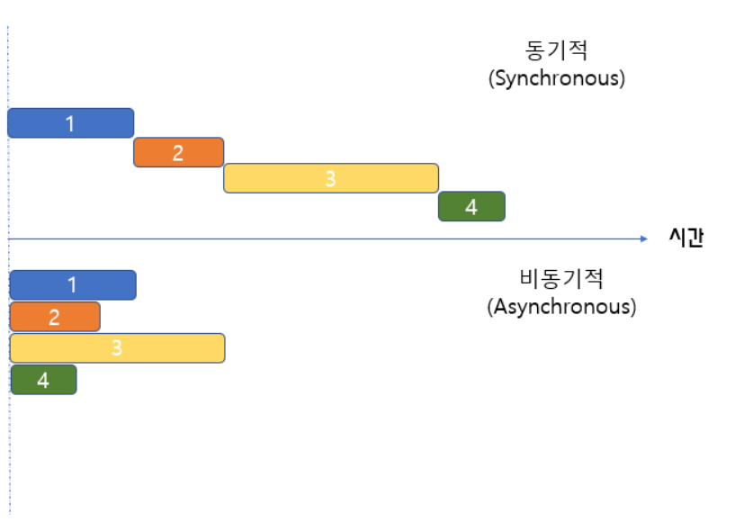

**비동기 처리란?**

<p align="center">

</p>
요청 받은 작업들을 한번에 처리하는 방식

a라는 작업을 하는 도중 b라는 작업이 요청이 들어왔을 때 a작업이 끝날 때까지 기다리지 않고 b 요청을 시작함

⇒ 작업이 시작되면 해당 작업이 완료될 때까지 기다리지 않고 다음 코드를 실행할 수 있음

예시

```jsx
// 1-1
console.log("Hello");

setTimeout(function () {
  console.log("Bye");
}, 3000);

console.log("Hello Again");

// Hello
// Hello Again
// Bye

// setTimeout 이라는 비동기 함수를 기다려주지 않고 다음 코드가 실행됨
```

**장점**

- 동시에 다양한 요청을 처리하기 때문에 자원을 효율적으로 사용할 수 있음
- Response를 기다리지 않고 Non Block 상태로 계속 자기일을 하기 때문에 동기 방식에 비해 성능이 좋음

**단점**

- 동기 방식 보다 구조가 복잡
- 처리 결과에 대한 순서를 보장할 수 없음
  - 여러가지 요청을 보냈을 때 뒤에 보낸 요청이 먼저 마무리 되었다면 뒤에 보낸 요청의 답이 먼저 올 수 있음
  - 처리 결과를 내보내는 순서는 요청이 완료되는 순서임

### 비동기 함수와 비동기 통신

---

```jsx
// 1-2
let cnt = 0;

let timerId = setInterval(() => {
  cnt++;
  console.log(cnt, "a");
}, 1000);

setInterval(() => clearInterval(timerId), 5000);

console.log(cnt);
```

---

비동기 함수를 호출하면 비동기로 작동하는 코드가 완료되지 않더라도 기다리지 않고 함수는 종료된다

이 말은 즉슨 비동기 함수 내부의 코드는 비동기 함수가 종료된 뒤에 완료됨을 의미한다

고로 비동기 함수의 처리 결과를 상위 스코프의 변수에 할당하거나 외부로 반환하면 기대와는 다른 결과가 나온다

위 1-2 코드를 예로 들어보자

setInterval이라는 비동기 함수를 만들어 상위 스코프에 선언한 cnt 변수를 1초에 한번 1씩 증가시키고 그 후 cnt의 값을 콘솔창에 출력하도록 한다

setInterval 함수는 총 5초동안 실행된다

위 함수의 출력은 어떠할까?

비동기 함수의 작동방식을 이해하지 못했다면

```jsx
1a
2a
3a
4a
5a
5
```

위와 같은 출력을 예측했을 것이다

그러나 전에도 말했 듯 비동기 함수는 내부 코드의 완료를 기다려주지 않고 함수를 종료 시켜버린다

고로 1-2의 출력은 아래와 같다

```jsx
0
1a
2a
3a
4a
5a
```

비동기 통신의 작동원리도 비동기 함수의 처리방식과 같다

---

```jsx
// 1-3

//json
/*
{
  "userName": "yeye"
}

*/

let userName = "empty";

fetch("./dum.json").then((Response) =>
  Response.json().then((data) => {
    console.log(data);
    name = data.userName;
  })
);

console.log(userName);
```

---

코드 1-3은 dum이라는 json 파일에서 user의 이름을 받아오는 작업을 수행한다

그렇다면 위의 코드의 출력은 무엇일까 예측해보자

비동기 통신(=비동기 함수)의 동작 방식을 몰랐다면 userName을 출력했을 때 `yeye` 가 나온다고 말했을 것이다

그러나 실제 출력 값은 `empty` 이다

왜냐하면 비동기 통신 또한 json 파일에 있는 데이터를 읽어온 뒤 userName이라는 변수에 값을 할당하는 과정을 기다려주지 않기 때문이다

**따라서 비동기 처리의 결과는 외부로 반환, 상위 스코프 변수에 할당할 수 없다**

**비동기 처리 결과에 대한 후속 처리는 비동기 함수 내부에서 수행해야 한다**
