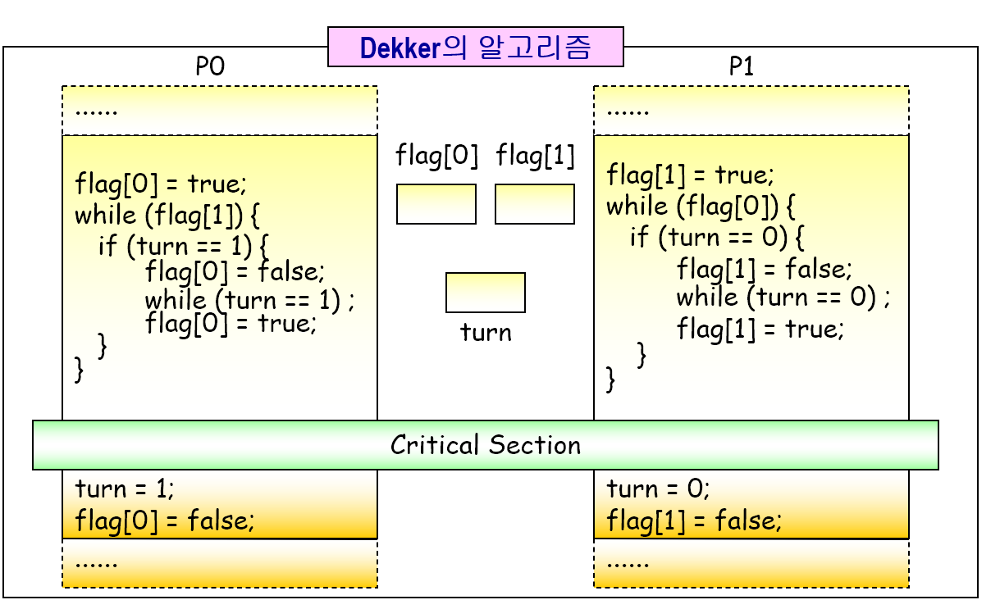
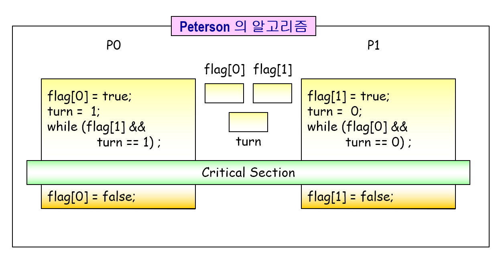
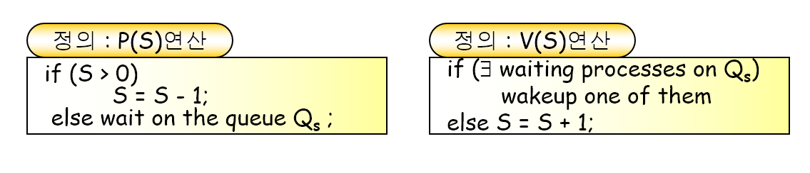

### 비동기 병행 프로세스

비동기적

- 각 프로세스들이 다른 프로세스들의 진행상태 등을 전혀 모름

병행성

- 시스템 내에 다수의 프로세스들이 동시에 존재함

→ 병행 수행중인 프로세스들이 동시에 공유 데이터에 접근할 때 문제 발생 가능

병행성 vs 병렬성

병행: 여러개의 프로세스들이 프로세서를 동시에 사용

병렬: 프로세서가 여러개 존재, 여러 프로세스드링 동시에 실행 가능

## 상호 배제

상호 간의 영향을 미치는 임계구역은 서로에 대해 원소적 실행이 보장되어야 한다

즉, **한 프로세스 / 스레드 임계구역 실행시 문맥교환이 발생하여 다른 프로세스 / 스레드가 실행되더라도 선점 당한 임계구역과 관련 있는 임계구역에는 접근 못하게 해야함**

- 공유 데이터
  - 여러 프로세스들에 의해 공동으로 사용되는 데이터
- 임계지역(cs)
  - 공유 프로그램에 접근하는 프로그램 세그먼트
- 상호 배제
  - 둘 이상의 프로세스의 임계지역 동시 진입을 금지시킴

### 기법

상호 배제 프리미티브

- enter sc() 프리미티브
  - 임계지역 진입 전 검사 과정
  - 다른 프로세스가 임계지역 내에 존재하는지 검사
  - 임계지역에 진입함을 시스템에 알림
- exit cs() 프리미티브
  - 임계지역에 벗어날 경우의 처리 과정
  - 임계지역에서 벗어남을 시스템에 알림
- 조건
  - 상호배제
    - 어느 한 프로세스가 자신의 cs를 실행중이면 다른 프로세스는 cs를 실행하면 안된다
  - 진행
    - cs를 수행하고자 하는 프로세스만 cs 수행 차례등의 제어과정에 참여할 수 있다
    - cs를 수행하고 있지 않은 프로세스가 다른 프로세스의 cs 진입을 방해하거나 결정할 수 없게한다
  - 제한된 대기(무한 연기 방지)
    - 한 프로세스가 임계구역에 대한 진입을 요청 후부터 요청의 수락까지의 기간내에 다른 프로세스가 임계구역을 실행할 수 있는 횟수에 제한을 두어야 한다

### 데커 알고리즘

→ 최초의 상호배제 알고리즘

### 피터슨 알고리즘

→ 데커에 비해 간단한 알고리즘

### 하드웨어적 상호배제 해결법

- 상호배제를 위한 소프트웨어적 기법의 문제
  1. low speed
  2. primitive 실행 중 preemption(선점) 가능성
     1. primitive: 어떤 목적을 달성하기 위해 가장 기본이 되는 연산
- 하드웨어 기법 예시
  - IBM의 ts(test and set) 명령(기계어 명령)
  - 원자성, 분리 불가능성 이용

기계어 명령의 특성

→ 원자성, 분리 불가능성

한 기계어 명령릐 실행 도중에 인터럽트를 받지 않음

상호배제: 하드웨어적 기법

- interrupt disabled / interrupt enabled
  - 임계구역 내 문맥 교환 자체를 방지
  - 특권 명령어로 사용자 모드에서는 사용 불가능
  - 커널 내의 시스템 호출 부분과 인터럽트 처리기의 임계 구역 보호를 위해 사용
- 단점
  - busy waiting
  - 비효율적

busy waiting 방지하는 상호 배제 기법

- 세머포 사용
- sequenser / event count 사용
- 임계지역에 즉시 진입할 수없는 프로세스들을 대기 상태로 전이 시킴

### 세머포

- 일종의 정수형 변수
- p()연산, v()연산, 그리고 초기화 연산에 의해서만 접근 가능
- 임의의 세머퍼 s에는 하나의 대기 큐가 할당됨

**이진 세머퍼**

- 세머퍼의 변수가 0과 1의 두 종류의 값만 갖는 경우
- 상호배제나 프로세스 동기화의 목적으로 사용

**카운팅 세머퍼**

- 세머퍼의 변수가 0 이상의 정수값을 갖는 경우
- 자원 할당, 생산자-소비자 문제 등의 해결을 위해 사용

세머포 변수에 대해 접근 가능한 연산

- 초기화 연산
- p(), v()연산 → 분리 불가능 연산

세머퍼를 이용해 해결 가능한 동기화 프로그래밍 문제들

- 상호 배제 문제
- 프로세스 동기화 문제
- 생산자 소비 문제
- Reader-Writer 문제
- 기타
