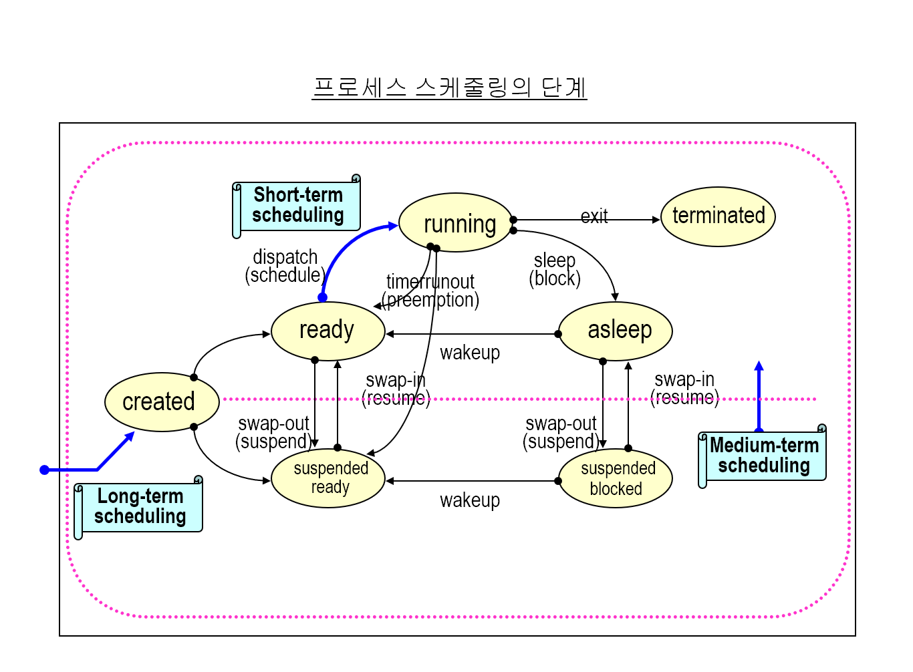
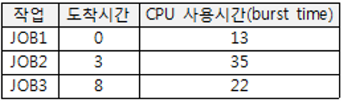
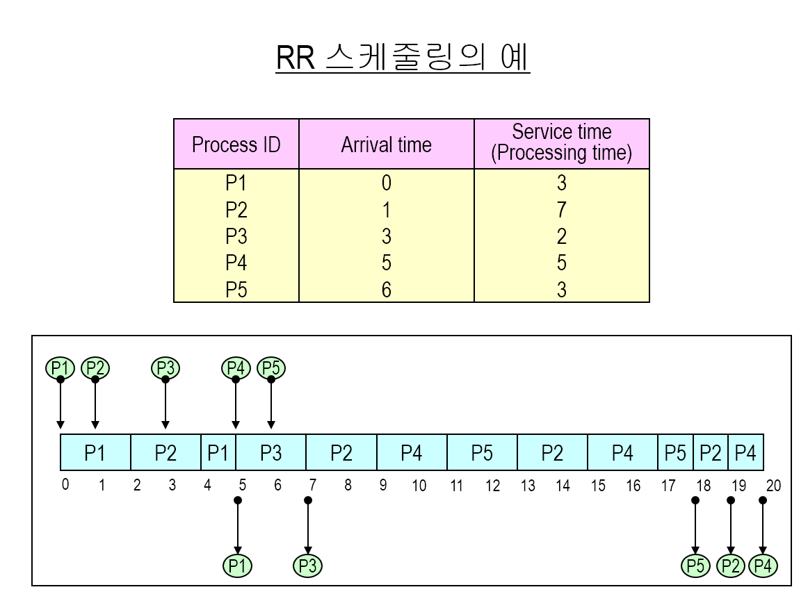
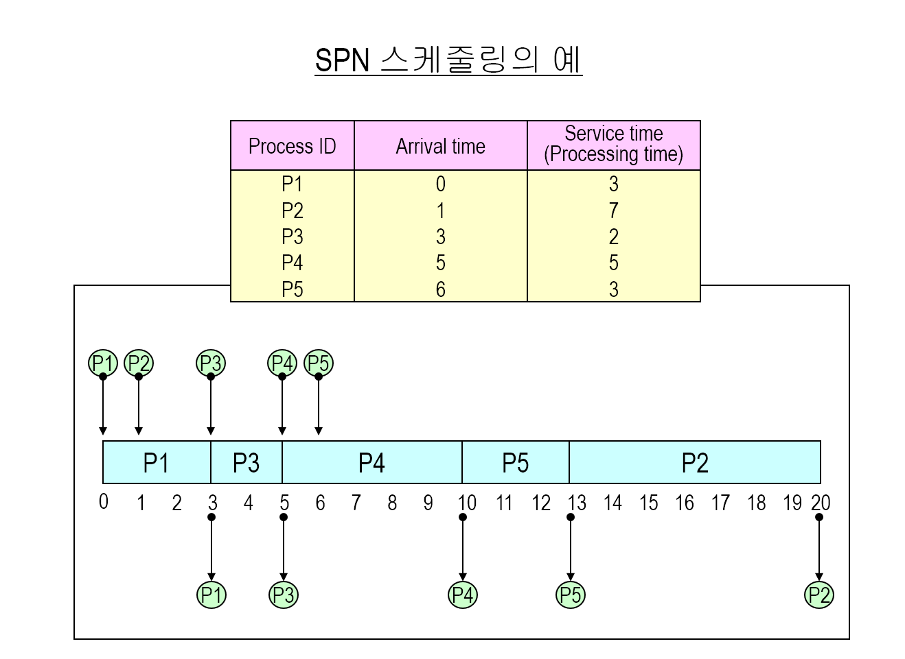
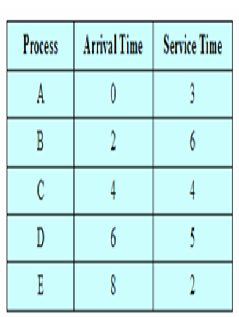

### **스케줄링의 목적**

→ 시스템 성능 향상

대표적인 시스템 성능 지표

- 응답 시간 → 시스템이 사용자의 요구에 응답하는 시간
- 작업 처리량 → 단위 시간 내의 프로세스 처리량
- 자원 활용도 → 주어진 기간 동안의 특정 자원 정도

일반 시스템의 os에서 고려하게 되는 성능 지표

- 공평성
- 작업 처리량
  - 일괄 처리 시스템에서 사용
- 평균 응답 시간
  - 대화형 처리 시스템에서 주로 사용
- 예측성
- 자원 활용도
- 무기한 연기 방지
  - 무기한 연기
    - 스케줄링 기법의 편향성에 의해 발생하는 현상
    - 특정 프로세스가 계속해서 자원을 사용하지 못하고 무한 대기
  - 에이징 기법 사용
    - 대기 시간이 경과할 수록 대기하는 프로세스의 우선순위를 높여줌

### 스케줄링 기준

스케줄링 기법이 고려하게 되는 항목

- 프로세스 속성
  - 입출력 위주, 연산 위주
- 시스템 속성
  - 일괄 처리 시스템 / 대화형 시스템
- 신속한 응답 시간의 중요성
  - 특정 프로세의 응답시간이 상대적으로 중요한 경우 우선순위 기법 제공
- 프로세스 우선순위
  - 우선순위 개념을 사용한 경우
- 프로세스 총 실행시간
- 프로세스 활용 목적
  - 응용 프로그램의 중요도 또는 활용분야에 따른 스케줄링

### 스케줄링 단계

수행 단계에 따라

**장기 스케줄링**

- job scheduling, admission scheduling, high-level scheduling
- 시스템에 입력되는 작업이나 커널 등록 순서 결정
- 다중 프로그래밍 정도 고려

**중기 스케줄링**

- intermediate scheduling
- 프로세스에 대해 주 기억장치 할당 순서 결정
- swap in, swap out
- os 기억장치 관리 기법에 의존

**단기 스케줄링**

- process scheduling, low-level scheduling
- 준비상태의 프로세스들에 대해 프로세서 할당 순서 결정
- 프로세스 스케줄러 또는 디스패처에 의해 수행
- 인터럽트 발생, 실행중인 프로세스에 의해 시스템 콜이 발생하는 경우 수행

### 스케줄링 기법

- 선점 / 비선점 정책
  - 비선점 스케줄링
    - 실행중인 프로세스 중지 불가능 스케줄링
    - 프로세스가 할당받은 자원을 스스로 반납 할 때까지 사용
    - 우선순위 x
    - 장
      - 프로세스 종료시간에 대해 비교적 정확한 예측 가능
    - 단
      - 평균 응답 시간이 길어질 수 있음
      - 일시적으로 우선순위가 지켜지지 않을 수 있음
  - 선점 스케줄링
    - 실행중인 프로세스 중지 가능 스케줄링
    - 대화형의 시분할 시스템, 실시간 시스템 등에 적합
    - 문맥 교환을 위한 오버헤드 증가

### 우선순위

프로세스의 중요도를 숫자로 표현

분류

- 정적 우선순위
  - 프로세스 생성 시 부여, 실행 중 불변
  - 구현 단순, 적은 오버헤드
  - 시스템 환경 변화에 적절한 대응 불가
- 동적 우선순위
  - 프로세스 생성 당시 초기에 우선순위 부여
  - 시스템과 프로세스 상태에 따라 우선순위 변경
  - 구현 복잡, 우선순위를 수시로 조정하는 오버헤드 큼
  - 환경 변화에 유연한 대응 가능
- 매입 우선순위
  - 고급 서비스를 제공 받기 위해 우선순위 매입
  - 정적 / 동적 우선순위와 합성되는 부가 기능

### fifo 스케줄링(fcfs)

- 비선점형 스케줄링
- 준비상태에 먼저 도달한 프로세스에 먼저 프로세서 할당
- 자원의 효율성 높음
- 일괄처리 시스템 등에 적합
- 대화형 시스템 등에 부적합
- 단점
  - 프로세서를 장시간 독점하는 경우 다른 프로세스들이 오래 기다려야함
  - 평균 응답 시간이 길어질 수 있음
- 평균 대기시간
  
  - p1은 대기시간이 없으므로 0
  - p2는 p1의 실행 시간 - p2의 도착시간
  - p3는 p1 실행시간 + p2 실행시간 - p3도착 시간
  - (0+ 10 + 40) / 프로세스 개수
  - (0+10+40)/3 = 16.n

### rr(round robin)스케줄링

- 선점형 스케줄링
- 준비상태에 먼저 들어간 프로세스에 먼저 프로세서를 할당함
- 각 프로세스에 시간 할당량 지정
- 시간할당량을 다 소모한 프로세스는 프로세서를 반납하고 준비상태로 전이
- 한 프로세스에 대한 프로세서 선점 방지
- 프로세서 선점에 따른 문맥 교환 오버헤드 증가
- 대화형 시스템, 시분할 시스템 적합
- 시간 할당량의 결정이 시스템에 큰 영향을 줌
  - 시간할당량이 매우크면 fcfs와 동일
  - // 매우 작으면 문맥교환 오버헤드가 커짐

- 스케줄링 방식 (시간할당량: 2)
- 큐 안에 먼저 p1이 들어감 2만큼 작업→ p1의 남은 시간 1
  - 큐→ [p1]
- p1이 동작하는 중에 p2준비 완료 큐에 들어감
  - [p1, p2]
- p1의 할당된 시간이 끝나면 pop
  - [p2]
  - 하지만 남은 시간이 있으니 push
  - [p2, p1]
- 반복

### spn(shortest process next)스케줄링

- shortest jop first 스케줄링
- 다음 실행시간이 가장 짧은 프로세스 부터 스케줄링
- 비선점형
- 장점
  - 평균 대기 시간 최소화
  - 시스템 내 대기 프로세스 최소화
  - 많은 프로세스들에게 빠른 응답시간 제공
  - 준비 큐 크기 감소, 저장공간 오버헤드 줄임
- 단점
  - 무기한 연기현상 발생 가능
    - 실행시간이 긴 프로세스들은 무기한 대기 가능
  - 프로세스 생성시 실행시간에 대해 정확한 계산 불가능
    - 정확한 계산 x 추정 o

- 다음 실행할 프로세스를 찾는 시점은 이전에 실행되던 프로세스가 끝나는 시점에서 준비가 완료된 프로세스들 중 실행시간이 짧은 것을 선택
- 위 사진에 경우 p1이 준비됐을 때는 준비된 프로세스가 1개이기에 p1 실행
- p1이 끝났을 때는 p2와 p3가 준비되어있기 때문에 두 프로세스 중 실행시간이 더 짧은 쪽을 선택해 실행 고로 p3 실행
- 이후 반복

### srtn(shortest remaining time next) 스케줄링

- spn 변형
- 실행 시간이 가장 적게 남은 프로세스에 먼저 프로세서 할당
- 선점형
- 단점
  - 실행시간 추정 작업 필요
  - 잔여 실행시간에 대한 계속적인 계산 오보헤드 증가
  - 실행시간이 긴 프로세스들의 평균 응답시간 길어짐
  - 잦은 선점으로 문맥교환 오버헤드 증가

- 다음 실행할 프로세스 찾는 법
- p1이 준비되었을 때는 준비된 프로세스가 p1뿐이라 p1 실행
- 실행 중 p2의 준비가 완료되었을 때 잠깐 p1의 작업을 멈추고 p1과 p2 중 실행시간이 적은(=적게 남은) 프로세스를 실행
  - → 고로 p1는 남은 실행시간이 5이고 p2는 남은 실행시간이 4이기에 p2 실행
- 이후 반복

**hrrn(high response ratio next) 스케줄링**

== hrn

ratio = 비율

- 비선점
- 실행시간이 긴 / 짧은 프로세스들 간의 불평등 심화 방지법
- 응답률이 가장 높은 프로세스에게 우선권을 주는 방식
- 응답률

- 특정 프로세스 장시간 대기 방지
  - 준비상태에서 기다리는 시간이 길어질 수록 우선순위 향상됨
- spn 스케줄링의 효과 얻음
- 단점
  - 프로세스 실행시간 추정 오버헤드 발생

- 시간 계산법
  - 처음에는 준비된 프로세스가 a밖에 없어서 a 실행
  - a가 끝나는 시점 3에서는 준비된 프로세스가 b밖에 없으므로 b 실행
  - b가 끝나는 시점 9에서는 남아있는 프로세스들이 모두 준비 됐기 때문에 계산 시작
    - c는 4 때 도착해 9까지 기다렸으므로 대기시간이 5 응답률은 1.8
    - d는 6때 도착해 9까지 기다렸으므로 대기시간이 3 응답률은 1.6
    - e는 8때 도착해 9까지 기다렸으므로 대기시간이 1 응답률은 1.5
  - 응답률이 제일 높은 c 실행 → 끝나는 시점은 13, 남아있는 프로세스 대기시간 계산
    - d = 13-6 = 7, 응답률 = 1.4
    - e = 13-8 = 5, 응답률 = 3.5
  - e 실행

**새로운 프로세스가 실행 된 뒤 끝날 때마다 남아있는 프로세스들의 응답시간 다시 계산**

mlq(multi level queue) 스케줄링

- ready queue를 여러개의 큐로 분할
- 프로세스들을 그 특성에 따라 하나의 큐로 분할
- 각 큐 별로 스케줄링 기법 필요
- 전체 큐들간의 스케줄링 기법 필요

다단계 피드백 큐

- multi level feedback queue
- 프로세스들에 대한 사전 정보가 전혀 없는 경우에도 사용 가능
  - 사전 정보 없이도 stn, srtn, hrrn 등의 효과를 보임
- 준비상태의 큐를 여러개 두어 사용
- 스케줄링 기법
  - dynamiv priority 사용
  - 선점형
- 단점
  - 시스템 부하 증가
  - 우선순위가 낮아진 프로세스 무한연기 발생
- 변형
  - 각 준비된 큐마다 시간 할당량을 다르게 배정
    - 디스패치된 프로세스는 해당 큐에 할당된 시간 할당량을 배정
    - 프로세스 특성에 맞는 형태로 시스템 운영가능
  - 입출력 위주의 프로세스들은 상위 큐로 이동 == 우선순위 높임
    - 시스템 전체 응답 시간 줄임
    - 입출력 작업 분산
  - 프로세스의 대기시간이 지정된 시간을 초과한 프로세스는 상위 큐로 이동
    - 에이징 기법
    - 특정 프로세스가 오랜 시간 준비 큐에서 대기하는 것을 방지
- parameters for MFQ scheduling
  - 큐의 갯수
  - 각 큐의 스케줄링 알고리즘
  - 더 상위 큐로 이동시키는 시기 결정 방법
  - 더 하위 큐로 이동시키는 시기 결정 방법
  - 프로세스가 처음 시작할 때 시작하는 큐 설정 방법
- mfq의 기본 목적
  - 짧은 실행시간을 요구하는 프로세스 선호
  - 입출력 위주의 프로세스 선호
  - 신속한 프로세스의 성격 분석으로 적응성 있게 스케줄링함
- 피드백
  - 현재까지 프로세서를 사용한 시간을 근거로 스케줄링
