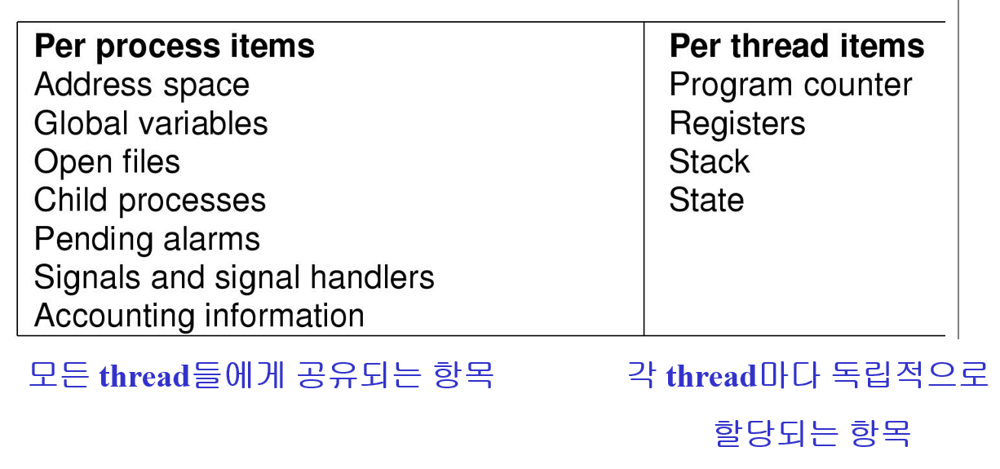

### 개념

작업

- 실행 프로그램과 이에 필요한 입력 데이터 묶음
- 컴퓨터에 실행되기 전 의뢰 상태

프로세스

→ 실행 중인 프로그램

- 커널에 등록된 작업
- 커널에 등록되어 커널의 관리하에 들어간 작업
- 각종 자원을 요청하고 할당 받을 수 있는 개체
- pcb를 할당받은 개체
- 실행 중에 각종 자원을 요구, 할당, 반납하기 때문에 능동적인 개체

pcb (process control block)

→ 프로세스 제어 블록

- 커널공간 내에 존재
- 프로세스의 일생동안 프로세스의 모든 정적 및 동적 정보를 가짐
- 커널에 등록 된 각 프로세스들에 대한 정보를 저장
- 커널을 이를 통해 프로세스 관리
- 준비 리스트, 대기리스트: pcb 리스트

pcb 내의 정보

- 프로세스 고유 번호
- 프로세스 우선순위
- 프로세스 현재 상태
- 메모리 관리정보
- i/o 상태정보
- 문맥 저장 영역

### 프로세스 상태

- running - > 실행
- waiting(= blocked)
  - 실행에 필요한 자원을 가지지 못했기에 입력 혹은 출력과 같은 이벤트를 기다림
- ready → 실행에 필요한 자원들을 다 가진채 cpu 할당(실행)을 기다림
- terminated → 종료

- **생성 created**
  - 사용자가 요청한 작업 커널 등록
  - pcb 할당
  - 새로운 프로세스 만들어짐
  - 일시적으로 거쳐가는 상태
  - 커널
    - 기억장치 공간 검사
    - 준비상태 또는 지연상태로 상태 전이
- **준비 ready**
  - 실행에 필요한 모든 자원을 할당받고 프로세서(cpu)를 할당받기 위해 기다리는 상태
  - 프로세서만 할당 받으면 바로 실행 가능
  - 디스패치 또는 스케쥴
    - 준비 상태에서 실행상태로 상태 전이
- **실행 running**
  - 프로세서에 의해 실행 중
  - 타임 슬라이스(프로세서 시간 할당량)를 소진하거나 이불력 요구등을 하여 cpu를 자진 반납할 때까지 실행
  - 선점(preemption)
    - 프러세서 시간 할당량 종료, 우선순위 등으로 인하여 자신에게 할당된 프로세서를 반납해야 하는 경우
  - 블럭(block / sleep)
    - 프러세스가 시스템 실행 중 자원을 요청하거나 기타 다른 이유로 system call을 해야하는 경우 대기상태로 전이
- **대기 blocked / asleep**
  - 프러세스가 프로세서 외의 특정 자원을 요청하고 이를 할당받을 때까지 기다리고 있는 상태
  - 입출력 요구, 사건 발생 대기 중에는 cpu가 필요없기에 반납
  - 대기 상태에서도 입출력은 발생할 수 있음
    - cpu와 i/o를 오버랩할 수 있는 기반이 됨
  - system call (supervisor call)
    - 커널은 프로세스의 요청을 받기 위한 시스템 콜 인터페이스를 제공
  - wakeup
    - 프로세스가 요청한 자원을 할당받는 등 사건(이벤트)이 발생하면 다시 준비 상태로 전이
- **지연 suspended**
  - 프로세스 생성 후 기억 장치의 양이 부족한 경우
  - 지연 준비 상태
    - 준비상태의 프로세스가 기억장치를 잃을 경우
  - 지연 대기 상태
    - 대기상태에서 프로세스가 기억장치를 잃을경우
  - 활동상태의 프로세스가 기억장치를 잃는 이유
    - 커널에 의해 선택되는 경우
      - 시스템 기능 이상
      - 시스템 과부하
    - 프로세스 스스로 기억장치를 반납하는 경우
      - 실행도중 프로그램의 의심스러운 부분 발견
  - swap-out)(suspend)
    - 프로세스가 기억장치를 잃는 경우
  - swap-in(resume)
    - 프로세스가 다시 기억장치를 할당받는 경우
- 종료 terminated
  - 프로세스의 실행이 완료되어 모든 자원을 반납하고 커널 공간 내에 pcb 등으 프로세스 관리 정보만이 남아있는 상태

### 레디 큐

준비 상태의 프로세스들의 공통점

- 프로세스 외의 모든 자원을 확보한 상태로 프러세서 요청중

준비 큐, 준비 리스트

프로세스 스케쥴링

→ 프로세서 가용시, 준비 리스트로부터 한 프로세스를 디스패치

### 블록 큐

대기상태의 프로세스 큐

각 프로세스가 요구한 자원의 종류에 따라 분류 가능

대기 리스트, 대기 큐

- 각 자원 종류별 관리
- 큐의 개수 = 커널이 관리하는 자원의 종류 수

1. a: ready b: blocked c: running
   1. a는 실행이 끝나면서 time run out 상태가되며 ready 상태로 변함
   2. 입출력을 받는 중이라 blocked
   3. 본문에서 실행 상태라 했으니 running
2. a, b, c 여러 프로세스를 옮겨가며 실행해야하기 때문에 **문맥교환**이 발생
3. b 프로세스는 blocked 상채이기 때문에 실행이 안돼 c로 넘어감

### 쓰레드

→ cpu 스케줄 단위

구성

- 쓰레드 id
- 프로그램 카운트
- 레지스터 세트
- 스택
- 전역변수

같은 프로세스에 속한 모든 쓰레드들은 코드, 데이터, 파일 등의 자원을 공유한다

**쓰레드 이점**

- 응답성
  - 한 쓰레드가 대기 상태가 되더라 다른 쓰레드는 실행 가능
- 자원공유
  - 코드, 데이터 기타 자원
- 경제성
  - 프로세스에 비해 쓰레드 생성 문맥교환 비용이 적음
- 다중 처리기 구조의 활용
  - 각 쓰레드가 다른 프로세서에서 병렬처리 가능

**인터럽트**

→ unexpected event→ 기대하지 않은 이벤트

인터럽트 종류

- 입출력 인터럽트
- 클럭 //
- 콘솔 //
- 프로세스간 통신 인터럽트 //
- 시스템 호출 //
- 프로그램 오류 //
- 하드웨어 검사 //

인터럽트 처리 과정

1. 인터럽트 발생
2. 프로세스 중단
3. 인터럽트 처리
4. 인터럽트 발생 장소, 원인 파악
5. 인터렄트 서비스 할것인지 결정
6. 인터럽트 서비스 루틴 호출

커널 → 인터럽트 발생 시 항상 개입하여 인터럽트의 처리 과정 및 인터럽트 서비스 과정을 제어

**문맥 보존 및 문맥 교환**

문맥

- 프로세스의 실행 중단 시 보존되고, 속개시 다시 원상 복구 되어애 하는 프로세스의 실행을 위한 모든 정보
- context saving
  - 실행 중인 프로세스의 레지스터 문맥 보존을 위하여 저장하는 일
- context restoring
  - 기존에 저장되어 있는 문맥을 프로세서로 다시 이동시키는 일
- context switching
  - 실행 상태의 프로세스를 다른 프로세스로 교체하기 위하여 그들의 문맥을 각각 저장하고 복원하는 일

**문맥 교환**

시분할 기반의 스케줄링에 의한 cpu 선점이나, **프로세스 스스로 입출력 요청에 의해 cpu를 반납할 때 cpu는 다른 프로세스에 할당 된다**

이 때 실행이 정지되는 프로세스의 문맥은 보존되고, 새로 실행되는 프로세스의 문맥이 활성화된다

사용자 수준 문맥은 메모리에 남아있지만 레지스터의 내용들은 추후 복구를 위해 저장되고 새로운 문맥이 적재된다

**프로세스 문맥 구성**

사용자 수준 문맥

- 텍스트 영역
- 자료 영역
- 스택 영역

시스템 수준의 문맥

- cpu 내의 각종범용 및 특수 레지스터의 내용
- 프로세스의 현재 각종 자원 사용 내역
- 기타 커널의 프로세스 관리 정보
